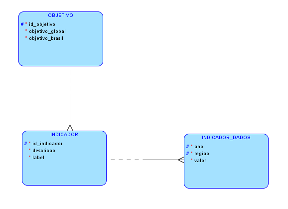
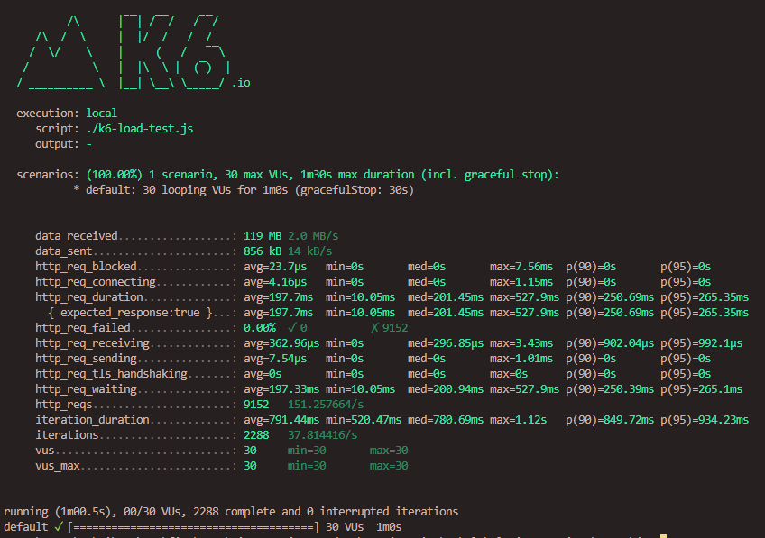

Integrantes do Grupo

Leonardo Gomes - RM 86869
Felipe Tardelli - RM 87783
Gabriel Matos - RM 87489

Modelo lógico do banco de dados

Resultados dos testes de carga do k6

Instruções de build do projeto

Após clonar o projeto, utilizar o seguinte código a partir da root do projeto:

        mvnw compile
        mvnw install
        mvnw package
        docker build . --tag=global-solution
        docker run -p 8080:8080 global-solution

